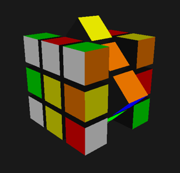

# Simple Rubik's Cube

## Description
This is meant to be a simple Rubik's Cube game built using OpenGL and GLFW. The end goal is to have a cube that can be scrambled by the computer and solved by the player.

## Current Functionality
- Cubes created and textured to match a Rubik's Cube.
- Rotation of the Rubik's Cube's sections implemented.
- Method for scrambling the Rubik's Cube implemented.
- Ability for player to select cube sections, change axes, and rotate sections clockwise and counterclockwise implemented.
- Simple highlighting of player selected sections.
